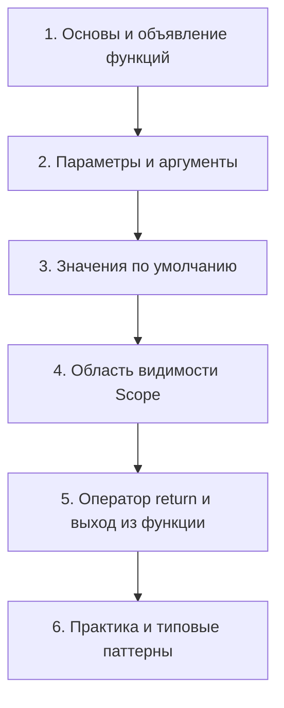
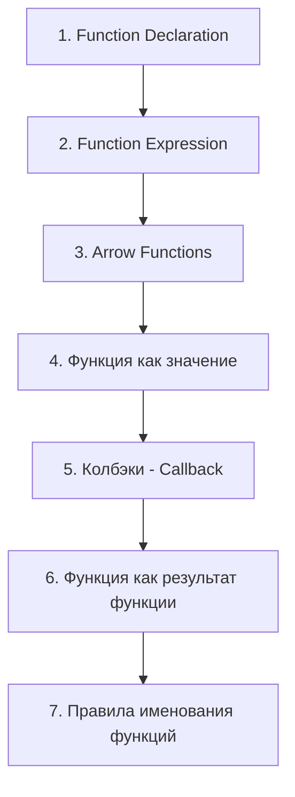
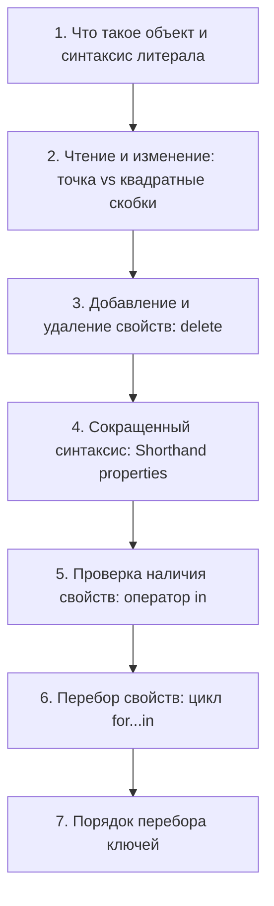
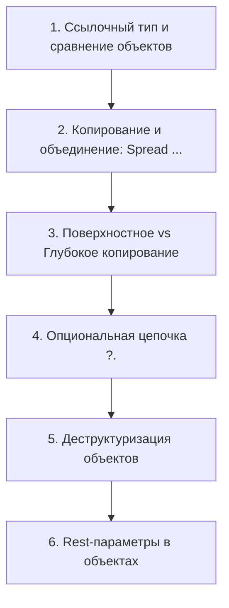
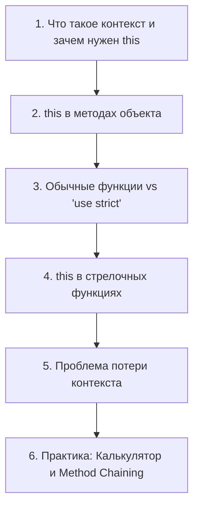

# 📚 Полный Конспект: План Урока По Видео (JavaScript)


---

## 👤 Тема / Запрос:
> https://youtu.be/rJK0eMkI3BE?si=UuzhCe7YfLjdR0ek давай разберем этот урок , составь пллан по нему

Этот урок посвящен фундаментальной теме в JavaScript: **«Функции в JavaScript: область видимости, параметры, аргументы, значения по умолчанию и оператор return»**.

Ниже представлен подробный разбор и план изучения материала по данному уроку с примерами, практическими заданиями и чек-листом для самопроверки.

---

## 📌 План изучения темы



---

### Блок 1. Что такое функция и как её объявить (Function Declaration)
* **Концепция:** Функция — это изолированный блок кода, предназначенный для выполнения определенной задачи. Позволяет следовать принципу **DRY** (*Don't Repeat Yourself*).
* **Синтаксис:**
  ```javascript
  // Объявление функции (Function Declaration)
  function showGreeting() {
    console.log("Привет, мир!");
  }

  // Вызов функции (Invoke / Call)
  showGreeting();
  ```
* **Ключевой момент:** При объявлении через `function declaration` работает *hoisting* (поднятие) — функцию можно вызывать в коде выше места её объявления.

---

### Блок 2. Параметры и аргументы
* **Разница в терминах:**
  * **Параметры** — переменные, указанные в круглых скобках при **объявлении** функции.
  * **Аргументы** — конкретные значения, которые передаются в функцию при её **вызове**.
* **Пример:**
  ```javascript
  // name и age — параметры
  function describeUser(name, age) {
    console.log(`Пользователю ${name} исполнилось ${age} лет.`);
  }

  // "Алексей" и 25 — аргументы
  describeUser("Алексей", 25);
  ```

---

### Блок 3. Параметры по умолчанию (Default Parameters)
* **Проблема:** Если при вызове аргумент не передан, параметр внутри функции получает значение `undefined`.
* **Решение в современном JS (ES6):**
  ```javascript
  function sendEmail(to, subject = "Без темы", isUrgent = false) {
    console.log(`Отправка на: ${to}, Тема: ${subject}, Срочно: ${isUrgent}`);
  }

  sendEmail("test@example.com"); 
  // Выведет: Отправка на: test@example.com, Тема: Без темы, Срочно: false
  ```

---

### Блок 4. Область видимости (Scope)
* **Глобальная область видимости (Global Scope):** переменные, объявленные снаружи функций, доступны внутри любой функции.
* **Локальная/функциональная область видимости (Local / Function Scope):** переменные (`let`, `const`, `var`), объявленные внутри функции, видны **только** внутри неё и уничтожаются после завершения работы функции.
* **Поиск переменных (Цепочка областей видимости):** JS ищет переменную сначала локально внутри функции, и если не находит — поднимается на уровень выше (во внешнюю/глобальную область).
* **Пример:**
  ```javascript
  let globalCount = 10; // Глобальная переменная

  function testScope() {
    let localCount = 5; // Локальная переменная
    console.log(globalCount); // 10 (доступна)
    console.log(localCount);  // 5 (доступна)
  }

  testScope();
  // console.log(localCount); // ОШИБКА: ReferenceError: localCount is not defined
  ```

---

### Блок 5. Оператор `return` и возврат значения
* **Получение результата:** `return` возвращает значение из функции в точку её вызова и **мгновенно завершает** выполнение функции.
* **Неявный возврат:** Если функция не содержит `return` (или написан пустой `return;`), она возвращает `undefined`.
* **Паттерн "Ранний выход" (Guard Clause):**
  ```javascript
  function calculateDiscount(price, isMember) {
    // Ранний выход для некорректных данных
    if (price <= 0) {
      return 0;
    }

    if (!isMember) {
      return price;
    }

    return price * 0.9; // Скидка 10%
  }

  const finalPrice = calculateDiscount(1000, true); // 900
  ```

---

## 🛠 Задачи для самостоятельной практики

1. **Базовая:** Напишите функцию `calculateArea(width, height)`, которая принимает ширину и высоту прямоугольника и возвращает его площадь. Если второй параметр не передан, считать фигуру квадратом (`height = width`).
2. **На область видимости:** Объявите глобальную переменную счетчика и функцию `increment()`, которая увеличивает локальную копию и выводит оба значения в консоль.
3. **На `return` и Guard Clauses:** Напишите функцию `checkAccess(age)`, которая:
   * возвращает `"Некорректный возраст"`, если возраст меньше 0;
   * возвращает `"Доступ запрещен"`, если возраст меньше 18;
   * возвращает `"Добро пожаловать"`, если возраст 18 и старше.

---

## ✅ Чек-лист для самопроверки

- [ ] Могу объяснить разницу между параметром и аргументом.
- [ ] Знаю, что возвращает функция, если в ней нет `return`.
- [ ] Понимаю, почему переменная внутри функции не видна снаружи.
- [ ] Умею задавать значения по умолчанию для параметров.
- [ ] Знаю, что код, написанный после `return` внутри функции, никогда не выполнится.

---

Если хотите разобрать какую-то конкретную часть подробнее или решить практические задачи вместе — напишите, с чего начнем!


---

## 👤 Тема / Запрос:
> https://youtu.be/IcgdjdeOziA?si=dkPAo3NKyOMm6mxt
> 
> сделай так же как предыдущий

Отлично, нашёл таймкоды! Составляю подробный план.

---

## 📌 Урок: Виды функций в JavaScript — Александр Ламков (Friendly Frontend)

**Тема:** Function Declaration, Function Expression, Arrow Functions, Callbacks, Naming



---

### Блок 1. Function Declaration — `00:29`
*(Классическое объявление функции)*

* **Концепция:** Знакомый синтаксис из предыдущего урока. Функция объявляется ключевым словом `function`.
* **Ключевая особенность — Hoisting (Поднятие):** JS поднимает объявление функции вверх, поэтому её можно вызвать **до** места объявления в коде.
* **Пример:**
  ```javascript
  // Вызов ВЫШЕ объявления — это работает!
  sayHello(); // "Привет!"

  function sayHello() {
    console.log("Привет!");
  }
  ```

---

### Блок 2. Function Expression — `03:05`
*(Функциональное выражение)*

* **Концепция:** Функция создаётся не отдельным оператором, а как часть выражения — присваивается переменной.
* **Ключевое отличие от Declaration:** **Нет hoisting!** Вызвать до объявления не получится — будет ошибка `Cannot access before initialization`.
* **Пример:**
  ```javascript
  // sayBye(); // ❌ ОШИБКА — hoisting не работает

  const sayBye = function() {
    console.log("Пока!");
  };

  sayBye(); // ✅ "Пока!"
  ```

---

### Блок 3. Стрелочные функции (Arrow Functions) — `04:38`
*(Современный лаконичный синтаксис, ES6)*

* **Концепция:** Компактная запись функций. Всегда являются **Function Expression**.
* **Синтаксис и сокращения:**
  ```javascript
  // Полная запись
  const multiply = (a, b) => {
    return a * b;
  };

  // Если параметр один — скобки можно убрать
  const double = n => {
    return n * 2;
  };

  // Если тело — одно выражение — фигурные скобки и return убираются (Implicit Return)
  const square = n => n * n;

  console.log(square(5)); // 25
  ```
* **Важное отличие:** У стрелочной функции нет собственного `this` и объекта `arguments` — она берёт их из внешнего контекста.

---

### Блок 4. Функция как значение (First-class functions) — `07:07`

* **Концепция:** В JavaScript функции — это **объекты первого класса**. Их можно:
  * присваивать переменной
  * передавать как аргумент в другую функцию
  * возвращать из функции
* **Пример:**
  ```javascript
  const greet = function(name) {
    return `Привет, ${name}!`;
  };

  // Функция как значение — её можно "переложить" в другую переменную
  const welcome = greet;
  console.log(welcome("Мария")); // "Привет, Мария!"
  ```

---

### Блок 5. Функции-колбэки (Callbacks) — `08:02`

* **Концепция:** **Callback (колбэк)** — это функция, которую передают как **аргумент** в другую функцию, чтобы вызвать её позже (по завершении задачи или по событию).
* **Пример — колбэк в кастомной функции:**
  ```javascript
  function doMath(a, b, callback) {
    const result = callback(a, b);
    console.log(`Результат: ${result}`);
  }

  const add = (x, y) => x + y;
  const sub = (x, y) => x - y;

  doMath(10, 5, add); // "Результат: 15"
  doMath(10, 5, sub); // "Результат: 5"
  ```
* **Реальный пример** — колбэк в `setTimeout`:
  ```javascript
  setTimeout(() => {
    console.log("Вызвано через 2 секунды!");
  }, 2000);
  ```

---

### Блок 6. Функция как результат функции (Higher-Order Functions) — `09:52`

* **Концепция:** Функция может **возвращать другую функцию**. Такой паттерн называется функцией высшего порядка (**Higher-Order Function**). Это основа для **замыканий (Closures)**.
* **Пример:**
  ```javascript
  function createMultiplier(factor) {
    // Возвращаем новую функцию, которая "помнит" factor
    return (number) => number * factor;
  }

  const triple = createMultiplier(3);
  const tenTimes = createMultiplier(10);

  console.log(triple(5));   // 15
  console.log(tenTimes(4)); // 40
  ```

---

### Блок 7. Как правильно называть функции? — `11:49`

* **Функция — это действие**, поэтому её имя должно быть **глаголом** или начинаться с него.
* **Популярные префиксы-глаголы:**

| Префикс | Назначение | Пример |
|---|---|---|
| `get` | Получить / вернуть значение | `getUserName()` |
| `set` | Установить / изменить | `setTheme()` |
| `create` | Создать что-то | `createElement()` |
| `render` | Отрисовать | `renderCard()` |
| `check` / `is` / `has` | Проверить (возвращает `boolean`) | `isLoggedIn()` |
| `handle` / `on` | Обработчик события | `handleClick()` |
| `show` / `hide` | Показать / скрыть | `showModal()` |

---

## 🆚 Сравнительная таблица видов функций

| | Declaration | Expression | Arrow |
|---|---|---|---|
| **Hoisting** | ✅ Да | ❌ Нет | ❌ Нет |
| **Собственный `this`** | ✅ Да | ✅ Да | ❌ Нет (берёт из контекста) |
| **Объект `arguments`** | ✅ Да | ✅ Да | ❌ Нет |
| **Использование** | Обычные функции | Колбэки, присвоение | Колбэки, короткие функции |

---

## 🛠 Задачи для самостоятельной практики

1. **На Arrow Function:** Перепишите обычную функцию `function add(a, b) { return a + b; }` сначала в Function Expression, затем в стрелочную (с implicit return).

2. **На Callback:** Создайте функцию `applyOperation(arr, callback)`, которая принимает массив чисел и колбэк, применяет его к каждому элементу и возвращает новый массив (аналог `Array.map`).

3. **На возврат функции:** Напишите `createGreeter(greeting)`, которая принимает приветствие (`"Привет"` / `"Hello"`) и возвращает функцию, принимающую имя и выводящую полное приветствие.

---

## ✅ Чек-лист для самопроверки

- [ ] Знаю разницу между Function Declaration и Function Expression.
- [ ] Понимаю, что такое hoisting и как он влияет на доступность функции.
- [ ] Умею записывать стрелочные функции, в том числе с implicit return.
- [ ] Знаю, почему у стрелочных функций нет собственного `this`.
- [ ] Понимаю, что такое колбэк, и могу привести пример.
- [ ] Понимаю концепцию «функция как значение».
- [ ] Умею правильно называть функции, используя глагольные префиксы.

---

Хочешь разобрать какой-то блок подробнее или сразу порешаем практические задачи? 😊


---

## 👤 Тема / Запрос:
> https://youtu.be/kXAM_VuiBMM?si=xQuh0uK_ABtSH_Yl
> теперь это видео , в самом начале пиши его полное название как основной заголовок

# Объекты в JavaScript. Свойства объекта — чтение, добавление, удаление, проверка наличия и перебор

**Канал:** Александр Ламков (Friendly Frontend)  
**Тема:** Основы объектов в JS: синтаксис литерала, операции над свойствами (`read`, `add`, `update`, `delete`), динамические ключи, сокращенный синтаксис (shorthand), оператор `in`, цикл `for...in` и порядок ключей.

---

## 📌 Общая структура урока



---

### Блок 1. Что такое объект и литерал объекта `{}`
* **Концепция:** Объект — это сложный (ссылочный) тип данных, представляющий собой коллекцию пар **«ключ: значение»** (*key: value*).
* **Синтаксис:**
  ```javascript
  // Литерал объекта (object literal)
  const user = {
    name: "Иван",
    age: 28,
    isAdmin: true
  };
  ```
* **Ключ (имя свойства):** всегда строка или символ (`Symbol`). Даже если написать число или идентификатор без кавычек, JS автоматически приведет его к строке.

---

### Блок 2. Чтение и изменение свойств: `.` vs `[]`
* **Точечная нотация (`user.name`):**
  * Используется в 90% случаев.
  * Работает только со статическими именами, являющимися валидными идентификаторами.
* **Квадратные скобки (`user["name"]`):**
  * Обязательны, если в имени есть пробелы, дефисы или спецсимволы (`"user-role"`, `"first name"`).
  * **Главная сила:** позволяют использовать **динамические ключи** (переменные и выражения).
* **Пример:**
  ```javascript
  const user = {
    name: "Иван",
    "favorite color": "blue"
  };

  // Чтение
  console.log(user.name); // "Иван"
  console.log(user["favorite color"]); // "blue"

  // Динамический доступ через переменную
  const propertyKey = "name";
  console.log(user[propertyKey]); // "Иван" (user.propertyKey вернул бы undefined)

  // Изменение (Update)
  user.name = "Алексей";
  user["favorite color"] = "green";
  ```

---

### Блок 3. Добавление и удаление свойств (`delete`)
* **Добавление нового свойства:** достаточно просто присвоить значение по новому ключу.
* **Удаление свойства:** оператор `delete`.
* **Пример:**
  ```javascript
  const product = {
    title: "Ноутбук",
    price: 50000
  };

  // Добавление (Add)
  product.inStock = true;
  product["category"] = "Электроника";

  // Удаление (Delete)
  delete product.price;

  console.log(product); 
  // { title: "Ноутбук", inStock: true, category: "Электроника" }
  ```

---

### Блок 4. Короткая запись свойств (Property Value Shorthand)
* **Концепция:** Если имя переменной совпадает с именем ключа объекта, можно опустить значение при создании.
* **Пример:**
  ```javascript
  function createUser(name, age) {
    return {
      name, // эквивалентно name: name
      age,  // эквивалентно age: age
      role: "user"
    };
  }

  const newUser = createUser("Анна", 22);
  console.log(newUser); // { name: "Анна", age: 22, role: "user" }
  ```

---

### Блок 5. Проверка наличия свойства (Оператор `in`)
* **Проблема обращения к несуществующему ключу:** возвращается `undefined`.
* **Почему `user.prop !== undefined` не всегда надежно?** Свойство может существовать в объекте, но явно хранить значение `undefined` (`{ role: undefined }`).
* **Оператор `in`:** возвращает `true`, если свойство реально существует в объекте.
* **Синтаксис:** `"имяКлюча" in объект`
* **Пример:**
  ```javascript
  const car = {
    brand: "Toyota",
    model: undefined
  };

  console.log("brand" in car); // true
  console.log("model" in car); // true (ключ существует, хоть значение и undefined)
  console.log("year" in car);  // false
  ```

---

### Блок 6. Перебор свойств объекта: цикл `for...in`
* **Концепция:** Специальная конструкция цикла для итерации по всем перечисляемым ключам объекта.
* **Пример:**
  ```javascript
  const user = {
    name: "Дмитрий",
    age: 30,
    city: "Москва"
  };

  for (let key in user) {
    console.log(`Ключ: ${key}, Значение: ${user[key]}`);
    // Внимание: для получения значения используется user[key], а НЕ user.key!
  }
  ```

---

### Блок 7. Порядок ключей в объектах (Property Ordering)
* **Правило JavaScript (ES6+):**
  1. **Целочисленные ключи** (строки, которые парсятся в целое число: `"1"`, `"2"`, `"10"`) автоматически сортируются **по возрастанию**.
  2. **Остальные строковые ключи** выводятся в **порядке добавления/объявления**.
  3. **Символы (`Symbol`)** идут последними в порядке добавления.
* **Пример:**
  ```javascript
  const codes = {
    "49": "Германия",
    "7": "Россия",
    "1": "США",
    "apple": "Яблоко"
  };

  for (let code in codes) {
    console.log(code); // Сначала "1", "7", "49", затем "apple"
  }
  ```

---

## 🛠 Задачи для самостоятельной практики

1. **Базовая (CRUD для свойств):** Создайте пустой объект `schedule`. Добавьте свойство `"8:30"` со значением `"Подъем"`, измените его на `"Зарядка"`, удалите это свойство и проверьте его отсутствие через оператор `in`.
2. **На динамические ключи:** Напишите функцию `countOccurrences(wordsArray)`, которая принимает массив слов и возвращает объект, где ключ — слово, а значение — сколько раз оно встретилось.
3. **На цикл `for...in` и подсчет:** Напишите функцию `sumSalaries(salaries)`, которая принимает объект с зарплатами команды (например, `{ john: 1000, ann: 1600, pete: 1300 }`) и возвращает общую сумму. Если объект пустой, функция должна возвращать `0`.

---

## ✅ Чек-лист для самопроверки

- [ ] Понимаю разницу между доступом через точку (`obj.key`) и скобки (`obj[key]`).
- [ ] Знаю, в каких случаях квадратные скобки незаменимы.
- [ ] Умею добавлять новые свойства и удалять существующие через `delete`.
- [ ] Понимаю, зачем нужен оператор `in` и чем он отличается от проверки `=== undefined`.
- [ ] Умею перебирать ключи и значения через цикл `for...in`.
- [ ] Знаю, как сортируются числовые и строковые ключи при переборе.


---

## 👤 Тема / Запрос:
> https://youtu.be/t_B7hl1W65E?si=53R19aqkWvZzZQn_
> так же

# JavaScript Objects: Comparison, Copying, Merging, Destructuring, and Rest Parameters

**Канал:** Александр Ламков (Friendly Frontend)  
**Тема:** Продвинутая работа с объектами в JavaScript: ссылочный тип данных, правила сравнения, поверхностное и глубокое копирование, объединение объектов через Spread-оператор (`...`), оператор опциональной цепочки (`?.`), деструктуризация объектов и Rest-параметры.

---

## 📌 Общая структура урока



---

### Блок 1. Объекты как ссылочный тип данных и их сравнение
* **Концепция:** Примитивные типы (числа, строки, boolean) копируются и сравниваются **по значению**. Объекты хранятся и копируются **по ссылке** (в переменной хранится лишь адрес ячейки памяти).
* **Сравнение объектов (`===`):**
  * Два объекта равны **только тогда**, когда они ссылаются на **один и тот же объект в памяти**.
  * Два разных объекта с одинаковым содержимым **не равны**.
* **Пример:**
  ```javascript
  const a = { name: "Иван" };
  const b = { name: "Иван" };
  console.log(a === b); // false (разные адреса в памяти)

  const c = a; // копируется ссылка
  c.name = "Олег";
  console.log(a.name);  // "Олег" (изменился и исходный объект)
  console.log(a === c); // true (одна и та же ссылка)
  ```

---

### Блок 2. Объединение и клонирование через Spread-оператор (`...`)
* **Концепция:** Spread-оператор (`...`) «распаковывает» свойства одного или нескольких объектов в новый объект.
* **Пример создания копии и слияния:**
  ```javascript
  const user = { name: "Анна", age: 25 };
  const permissions = { canEdit: true, canDelete: false };

  // Клонирование объекта
  const userClone = { ...user };

  // Объединение объектов с добавлением/перезаписью свойств
  const fullUser = {
    ...user,
    ...permissions,
    role: "admin",
    age: 26 // перезапишет age из user
  };

  console.log(fullUser);
  // { name: "Анна", age: 26, canEdit: true, canDelete: false, role: "admin" }
  ```

---

### Блок 3. Поверхностное (Shallow) vs Глубокое (Deep) копирование
* **Поверхностное копирование (`{ ...obj }`, `Object.assign()`):**
  * Копирует только свойства первого уровня.
  * Если внутри есть вложенные объекты или массивы — копируются только их **ссылки**.
* **Глубокое копирование (`structuredClone(obj)`):**
  * Создает полностью независимую копию объекта на всех уровнях вложенности.
* **Пример:**
  ```javascript
  const user = {
    name: "Иван",
    address: { city: "Москва" }
  };

  // Поверхностная копия
  const shallowCopy = { ...user };
  shallowCopy.address.city = "Казань";
  console.log(user.address.city); // "Казань" ❌ (вложенный объект мутировал)

  // Глубокая копия (современный нативный стандарт JS)
  const deepCopy = structuredClone(user);
  deepCopy.address.city = "Сочи";
  console.log(user.address.city); // "Казань" ✅ (исходный объект не изменился)
  ```

---

### Блок 4. Опциональная цепочка (Optional Chaining `?.`)
* **Проблема:** Попытка прочитать свойство из `null` или `undefined` приводит к фатальной ошибке `TypeError: Cannot read properties of undefined`.
* **Решение:** Оператор `?.` безопасно проверяет наличие свойства слева. Если там `null` или `undefined`, выполнение останавливается и возвращается `undefined` без выброса ошибки.
* **Пример:**
  ```javascript
  const user = {
    name: "Елена"
    // address не определен
  };

  // console.log(user.address.city); // ❌ ОШИБКА: TypeError
  console.log(user.address?.city);    // undefined ✅ (безопасно)
  console.log(user.getAvatar?.());   // вызов метода, если он существует
  ```

---

### Блок 5. Деструктуризация объектов (Object Destructuring)
* **Концепция:** Удобный синтаксис для извлечения свойств объекта напрямую в отдельные переменные.
* **Возможности:**
  1. Извлечение по имени ключа.
  2. Переименование переменных при извлечении.
  3. Установка значений по умолчанию (Default values).
  4. Вложенная деструктуризация.
* **Пример:**
  ```javascript
  const product = {
    title: "Смартфон",
    price: 30000,
    tags: { popular: true }
  };

  // Базовое извлечение + переименование + значение по умолчанию
  const { 
    title, 
    price: cost, // переименовали price в cost
    discount = 0, // значение по умолчанию, если ключа нет
    tags: { popular } // вложенная деструктуризация
  } = product;

  console.log(title);   // "Смартфон"
  console.log(cost);    // 30000
  console.log(discount);// 0
  console.log(popular); // true
  ```
* **Деструктуризация в параметрах функций:**
  ```javascript
  function printUserCard({ name, role = "гость" }) {
    console.log(`Пользователь: ${name}, Статус: ${role}`);
  }

  printUserCard({ name: "Артем" }); // "Пользователь: Артем, Статус: гость"
  ```

---

### Блок 6. Rest-параметры в объектах (`...rest`)
* **Концепция:** При деструктуризации оператор `...` собирает все **оставшиеся** свойства в отдельный новый объект.
* **Синтаксис:** Должен находиться **строго в самом конце** списка деструктуризации.
* **Пример:**
  ```javascript
  const config = {
    host: "localhost",
    port: 8080,
    protocol: "https",
    auth: true
  };

  // Забираем host и port, остальное собираем в объект extraOptions
  const { host, port, ...extraOptions } = config;

  console.log(host);         // "localhost"
  console.log(port);         // 8080
  console.log(extraOptions); // { protocol: "https", auth: true }
  ```

---

## 🛠 Задачи для самостоятельной практики

1. **На ссылочный тип и копирование:** Напишите функцию `cloneAndModify(user, newCity)`, которая принимает объект пользователя с вложенным свойством `info: { city: "..." }`, делает глубокую копию с помощью `structuredClone`, меняет город и возвращает новый объект, не изменяя исходный.
2. **На деструктуризацию параметров:** Создайте функцию `createButton({ text = "Нажми меня", color = "blue", isDisabled = false })`, которая принимает объект настроек и выводит строку конфигурации кнопки.
3. **На Spread и Rest:** Дан объект товара со свойствами `id`, `name`, `price`, `weight`, `dimensions`. С помощью деструктуризации и Rest получите переменные `id` и `name`, а остальные свойства сохраните в объект `details`. Затем сформируйте новый объект, добавив к `details` поле `inStock: true`.

---

## ✅ Чек-лист для самопроверки

- [ ] Могу объяснить, почему `{ a: 1 } === { a: 1 }` возвращает `false`.
- [ ] Знаю разницу между передачей примитива и объекта в переменную/функцию.
- [ ] Умею клонировать и объединять объекты через `{ ...obj1, ...obj2 }`.
- [ ] Понимаю разницу между поверхностной копией и глубокой (`structuredClone`).
- [ ] Знаю, от каких ошибок защищает оператор опциональной цепочки `?.`.
- [ ] Умею применять деструктуризацию с переименованием и значениями по умолчанию.
- [ ] Понимаю, как работает Rest (`...rest`) при деструктуризации объектов.


---

## 👤 Тема / Запрос:
> https://youtu.be/cYx5ckAYhK8?si=ytYr-G4jEa91rF8V
> теперь следующий урок

# JavaScript 'this' Keyword for Beginners • 'this' in Objects and Functions

**Канал:** Александр Ламков (Friendly Frontend)  
**Тема:** Контекст выполнения и ключевое слово `this` в JavaScript: поведение `this` в обычных функциях и методах объектов, потеря контекста, поведение `this` в стрелочных функциях, создание практических объектов (Калькулятор) и реализация цепочки вызовов методов (Method Chaining).

---

## 📌 Общая структура урока



---

### Блок 1. Что такое `this` и концепция контекста
* **Концепция:** `this` — это специальное ключевое слово в JavaScript, которое ссылается на **объект, в контексте которого выполняется текущая функция**.
* **Главное правило:** Значение `this` определяется **в момент вызова** функции (*runtime binding*), а не в момент её написания или объявления (за исключением стрелочных функций).
* **Зачем нужен:** Позволяет методам объекта обращаться к свойствам своего же объекта без жесткой привязки к имени конкретной переменной.

---

### Блок 2. `this` внутри методов объекта
* **Концепция:** Когда функция вызывается как метод объекта через точку (`obj.method()`), `this` внутри метода указывает на объект перед точкой (`obj`).
* **Пример:**
  ```javascript
  const user = {
    name: "Дмитрий",
    age: 27,
    greet() {
      // this ссылается на объект user
      console.log(`Привет, меня зовут ${this.name}, мне ${this.age} лет.`);
    }
  };

  user.greet(); // "Привет, меня зовут Дмитрий, мне 27 лет."

  // Один и тот же метод можно переиспользовать в разных объектах:
  const admin = { name: "Анна", age: 32 };
  admin.greet = user.greet;
  admin.greet(); // "Привет, меня зовут Анна, мне 32 лет." (this стал admin)
  ```

---

### Блок 3. `this` в обычных функциях (не методах) и `'use strict'`
* **Без строгого режима (non-strict mode):** Если вызвать обычную функцию без объекта (`fn()`), `this` ссылается на глобальный объект (`window` в браузере или `global` в Node.js).
* **В строгом режиме (`"use strict"`):** `this` равен `undefined`, что защищает от случайного загрязнения глобального объекта.
* **Пример:**
  ```javascript
  "use strict";

  function showThis() {
    console.log(this);
  }

  showThis(); // undefined (без "use strict" вывел бы объект window)
  ```

---

### Блок 4. `this` в стрелочных функциях (Arrow Functions)
* **Ключевая особенность:** У стрелочных функций **нет своего собственного `this`**.
* **Лексический `this`:** Стрелочная функция берет значение `this` из внешнего окружения (где она была создана).
* **Важное правило:** Стрелочные функции **нельзя** использовать как методы объектов, если внутри требуется доступ к свойствам объекта через `this`.
* **Пример:**
  ```javascript
  const person = {
    name: "Игорь",
    // ❌ Ошибка: стрелочная функция возьмет внешний this (window/undefined)
    sayBad: () => {
      console.log(this.name); // undefined
    },
    // ✅ Правильно: обычный метод или Function Declaration
    sayGood() {
      console.log(this.name); // "Игорь"
    },
    // ✅ Отлично: стрелочная функция внутри обычного метода
    printHobbies() {
      const hobbies = ["код", "спорт"];
      hobbies.forEach((hobby) => {
        // Стрелочная функция сохраняет this родительского метода printHobbies
        console.log(`${this.name} любит ${hobby}`);
      });
    }
  };

  person.sayGood();
  person.printHobbies();
  ```

---

### Блок 5. Потеря контекста (Lost Context)
* **Типичная ошибка:** При передаче метода объекта в качестве колбэка (например, в `setTimeout` или обработчик события) вызывается просто функция без объекта перед точкой, и контекст теряется.
* **Пример и решение:**
  ```javascript
  const user = {
    name: "Мария",
    sayHi() {
      console.log(`Привет, ${this.name}`);
    }
  };

  // ❌ Потеря контекста:
  setTimeout(user.sayHi, 1000); // "Привет, undefined"

  // ✅ Решение 1: Обертка в стрелочную функцию
  setTimeout(() => user.sayHi(), 1000); // "Привет, Мария"

  // ✅ Решение 2: Явная привязка через bind
  setTimeout(user.sayHi.bind(user), 1000); // "Привет, Мария"
  ```

---

### Блок 6. Практика: Калькулятор и Method Chaining (цепочка вызовов)
* **Концепция Method Chaining:** Чтобы вызывать методы объекта по цепочке (`ladder.up().up().down().showStep()`), каждый изменяющий метод должен возвращать сам объект — то есть `return this`.
* **Пример 1 — Объект-калькулятор:**
  ```javascript
  const calculator = {
    a: 0,
    b: 0,
    setValues(a, b) {
      this.a = Number(a);
      this.b = Number(b);
    },
    sum() {
      return this.a + this.b;
    },
    mul() {
      return this.a * this.b;
    }
  };

  calculator.setValues(10, 5);
  console.log(calculator.sum()); // 15
  console.log(calculator.mul()); // 50
  ```

* **Пример 2 — Реализация цепочки вызовов (Method Chaining):**
  ```javascript
  const stepCounter = {
    step: 0,
    up() {
      this.step++;
      return this; // Возвращаем сам объект для цепочки
    },
    down() {
      this.step--;
      return this;
    },
    showStep() {
      console.log(`Текущая ступенька: ${this.step}`);
      return this;
    },
    reset() {
      this.step = 0;
      return this;
    }
  };

  // Вызов по цепочке:
  stepCounter.up().up().up().down().showStep().reset().showStep();
  // Выведет: 
  // "Текущая ступенька: 2"
  // "Текущая ступенька: 0"
  ```

---

## 🛠 Задачи для самостоятельной практики

1. **Калькулятор с валидацией:** Доработайте объект `calculator` так, чтобы метод `setValues(a, b)` проверял, являются ли переданные значения числами (не `NaN`). Добавьте метод `div()` с защитой от деления на ноль.
2. **Исправление потери контекста:** Дан код:
   ```javascript
   const timer = {
     seconds: 0,
     start() {
       setInterval(function() {
         this.seconds++;
         console.log(this.seconds);
       }, 1000);
     }
   };
   ```
   Исправьте ошибку потери `this` внутри `setInterval` двумя способами (через стрелочную функцию и через сохранение ссылки на `this`).
3. **Цепочка вызовов (Chaining) для счета:** Создайте объект `bankAccount` со свойствами `balance` (по умолчанию 0) и методами `deposit(amount)`, `withdraw(amount)` и `getBalance()`, поддерживающими непрерывную цепочку вызовов `bankAccount.deposit(100).withdraw(30).deposit(50).getBalance()`.

---

## ✅ Чек-лист для самопроверки

- [ ] Понимаю, что значение `this` определяется в момент вызова функции (динамический контекст).
- [ ] Знаю, чему равен `this` в обычной функции в строгом режиме (`"use strict"`) и без него.
- [ ] Понимаю, почему стрелочные функции не имеют своего `this` и как они берут контекст извне.
- [ ] Знаю, почему нельзя объявлять методы объекта через стрелочные функции, если нужен доступ к `this`.
- [ ] Понимаю, когда и почему происходит потеря контекста при передаче функций в качестве колбэков.
- [ ] Умею возвращать `return this` из методов для построения цепочек вызовов (*Method Chaining*).

